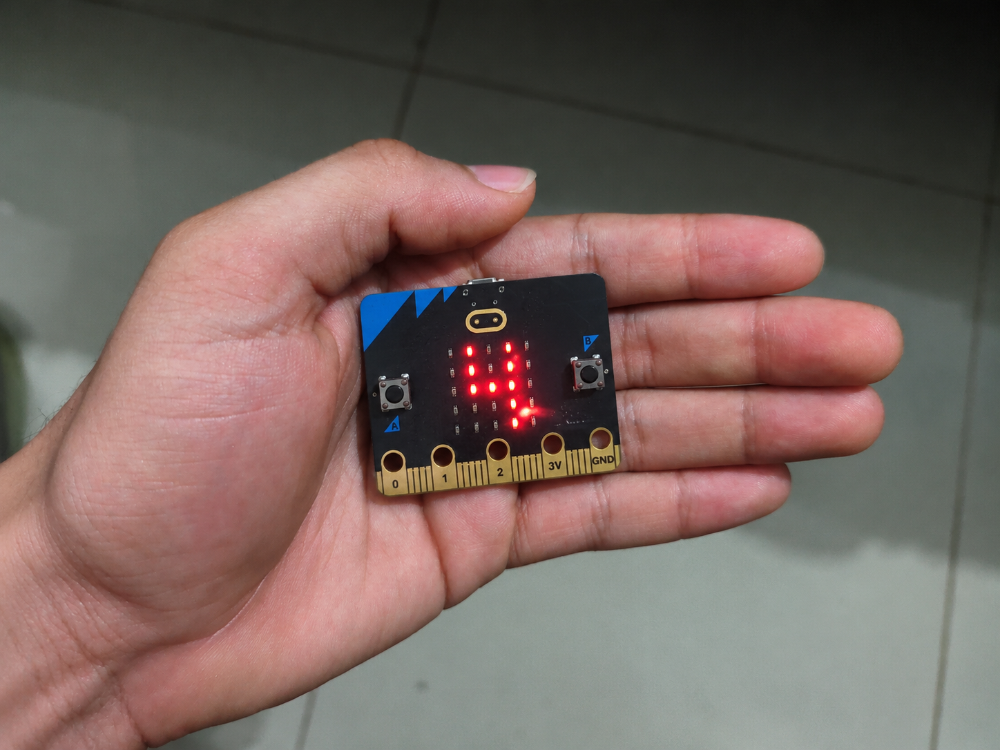
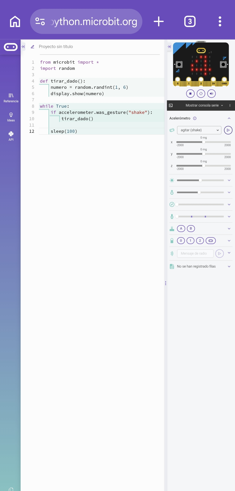

# Evidencia - Dado Digital D6

## Prueba del proyecto

La prueba física fue realizada por Alejandro Bruges y el programa funcionó correctamente en la BBC micro:bit.

## Evidencia del código y simulador

En el Python Editor oficial se probó el programa usando la opción de agitar. El simulador respondió correctamente y mostró el número 4.

## Registro de prueba

| Qué probé | Resultado | Cambio realizado |
|---|---|---|
| Carga del programa | Exitoso | No fue necesario |
| Inicio | Exitoso | No fue necesario |
| Movimiento al agitar | Exitoso | No fue necesario |
| Número en pantalla | Exitoso | No fue necesario |
| Rango del 1 al 6 | Exitoso | No fue necesario |
| Varios lanzamientos | Exitoso | No fue necesario |
| Reinicio | Exitoso | No fue necesario |
| Prueba final | Exitoso | No fue necesario |

## Resultado general

Probé el programa en la micro:bit y todo funcionó bien. Al agitarla, detectó el movimiento y mostró el número 4. Lo probé varias veces y respondió correctamente.

## Reflexión

### 1. ¿Qué parte ayudó a crear la IA?

La parte en la que me ayudó la IA fue a organizar mejor el prompt y a tener una idea de cómo podía hacer el código del dado digital.

### 2. ¿Qué partes revisé y entendí yo?

Las partes que revisé y entendí yo fueron cómo el acelerómetro detecta cuando agito la micro:bit, cómo se genera el número del 1 al 6 y cómo después aparece en la pantalla.

### 3. ¿La primera versión funcionó?

Sí, la primera versión me funcionó bien. La probé varias veces y la micro:bit respondió como esperaba.

### 4. ¿Tuve que corregir algo?

No tuve que corregir nada porque cuando hice las pruebas el programa funcionó bien y no me presentó ningún problema.

### 5. ¿Qué aprendí al probar el programa?

Lo que aprendí fue que no es solamente hacer el código y ya. También hay que probarlo en la micro:bit para saber si de verdad funciona como uno espera.

### 6. ¿Qué diferencia encontré entre tener el código escrito y verlo funcionando realmente?

La diferencia que encontré fue que al principio solamente tenía el código y sabía lo que debía hacer, pero cuando lo probé pude ver realmente cómo la micro:bit detectaba el movimiento y mostraba los números.

### 7. ¿Qué podría mejorar del prompt?

Lo que podría mejorar del prompt sería explicar algunas cosas con más claridad desde el principio, para que el código salga más organizado y sea más fácil de entender.
